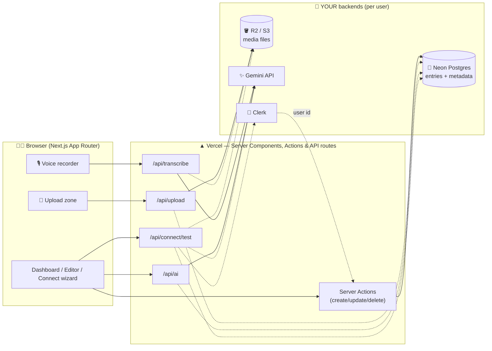
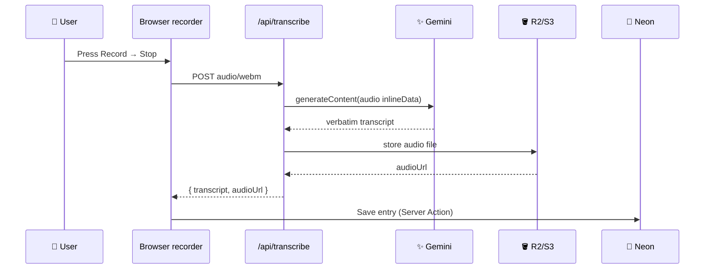
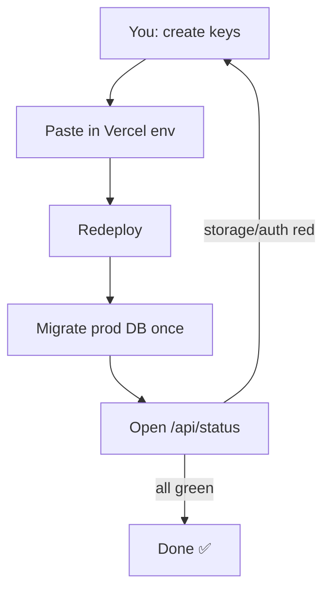
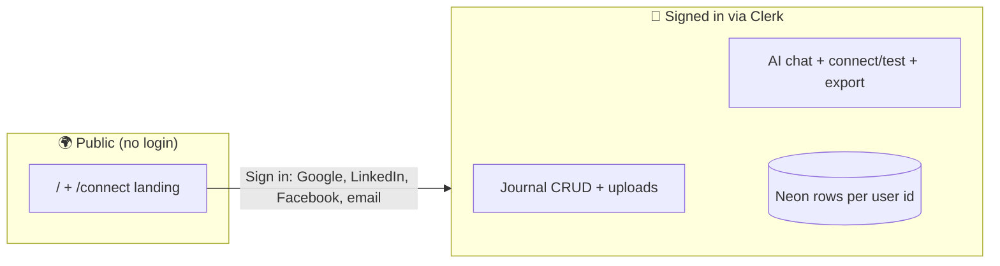

<div align="center">

# 🎙️ Your Voice Journal 📝

### AI-powered voice + multimedia journaling on **your own** Neon Postgres, S3/R2, Gemini & Clerk.

[](https://nextjs.org/)
[](https://www.typescriptlang.org/)
[](https://tailwindcss.com/)
[](https://www.prisma.io/)
[](https://neon.tech/)
[](https://aistudio.google.com/)
[](https://clerk.com/)
[](https://your-voice-journal.vercel.app/)
[](https://github.com/aniruddhaadak80/your-voice-journal/actions)
[](LICENSE)

**🌐 Live demo:** https://your-voice-journal.vercel.app · **🔌 Setup wizard:** [/connect](https://your-voice-journal.vercel.app/connect) — paste keys, test live, done.

No shared database. No shared API keys. Every user brings their own backends — the app is just the beautiful shell around *your* data.

</div>

---

## ✨ Features

| Area | What you get |
|------|--------------|
| 🎙️ **Voice journaling** | Browser recorder → Gemini transcription → transcript + audio URL saved in Postgres |
| 🖼️ **Multimedia** | Images, video, audio, PDFs, docs via S3-compatible upload (`/api/upload`) + gallery |
| ✍️ **Rich text** | TipTap editor — headings, lists, code, quotes, links, embedded uploads |
| 🔍 **Advanced search** | Full-text over title + content + transcript **plus mood, tag, date-range and newest/oldest ordering** (+ optional `tsvector` migration) |
| 🤖 **AI (Gemini)** | Summarize, suggest tags, **generate titles, detect mood, Ask-my-journal** (retrieval + grounded answers) with **Deep search** (AI query expansion → multi-term retrieval) |
| 🔌 **Connect wizard** | `/connect` — step-by-step guides with links, paste-to-test Neon/S3/Gemini/Clerk, `.env` generator |
| 🔐 **Clerk auth** | Per-user private journals when keys set; graceful single-user demo mode otherwise |
| 📤 **Export** | One-click JSON / Markdown download of your entries |
| 🎨 **Modern UI** | Tailwind v4, dark mode, Framer Motion transitions, skeletons, Suspense streaming |

## 🧰 Tech stack

| Layer | Choice | Why |
|-------|--------|-----|
| Framework | **Next.js 15** App Router | Server Components, Server Actions, streaming, `loading`/`error` boundaries |
| Language | **TypeScript 5** | End-to-end type safety |
| Styling | **Tailwind CSS v4** + `next/font` (Inter) | Design system, dark mode, zero font CDN |
| Animation | **Framer Motion** · Icons **lucide-react** | Page/list/modal micro-interactions |
| ORM | **Prisma 5** | Typed Postgres access, migrations, seed |
| Database | **Neon Postgres** (BYO) | Serverless Postgres, branching, free tier |
| Files | **S3-compatible** (Cloudflare R2 / AWS S3) | 50 MB uploads, images/video/audio/PDF/docs |
| AI | **Google Gemini** (BYOK) | Transcription + summaries + tags + Q&A, generous free tier |
| Auth | **Clerk** (optional) | Sign-in, per-user data isolation, drop-in UI |
| Editor | **TipTap 2** | ProseMirror-based, keyboard accessible |
| Tests/CI | **Vitest** + GitHub Actions + Vercel | Typecheck, lint, tests, build on every push |

## 🏗️ Architecture



## 🎙️ Voice flow



## 🚀 Quickstart (local)

```bash
pnpm install
cp .env.example .env   # fill in — or use the /connect wizard on the live site
pnpm exec prisma migrate deploy
pnpm run db:seed       # optional demo entries
pnpm dev               # → http://localhost:3000
```

> The app **never crashes** without env vars — it shows the Connect wizard state instead. `/api/status` reports db/storage/ai/auth health.

## 🔌 Connect your own backends (3 minutes)

Prefer the UI? Open **[/connect](https://your-voice-journal.vercel.app/connect)** — guides, live connection tests, and a `.env` generator.

1. **Neon Postgres → `DATABASE_URL`**
   [console.neon.tech](https://console.neon.tech) → New Project → Connection Details → copy string ([docs](https://neon.tech/docs/connect/connect-from-any-app))
2. **Storage → `S3_*`**
   [dash.cloudflare.com](https://dash.cloudflare.com) → R2 → bucket + API token ([R2 docs](https://developers.cloudflare.com/r2/)) — or [AWS S3](https://s3.console.aws.amazon.com)
3. **Gemini → `GEMINI_API_KEY`**
   [aistudio.google.com/apikey](https://aistudio.google.com/apikey) → Create key (free)
4. **Clerk (optional) → `NEXT_PUBLIC_CLERK_PUBLISHABLE_KEY` + `CLERK_SECRET_KEY`**
   [dashboard.clerk.com](https://dashboard.clerk.com) → app → API keys ([Next.js guide](https://clerk.com/docs/quickstarts/nextjs)) → **redeploy**
5. **Migrate**: `pnpm exec prisma migrate deploy` (+ optional `psql $DATABASE_URL -f prisma/fulltext.sql` for `tsvector` ranking)

## ▲ Deploy (Vercel — with the dev/test Clerk keys)

```bash
vercel --prod   # or: https://vercel.com/new → import your-voice-journal
```

Paste the **test** Clerk keys (`pk_test_…` / `sk_test_…` from `.env.local`) at Project → Settings → Environment Variables → **Redeploy** — the auth wall activates on deploy. Run step 5 above once against prod, and check `/api/status` — everything should read green. (Swap to `pk_live_…`/`sk_live_…` whenever you want production auth.)

## ✅ Production status & manual checklist (only YOU can do these)

Live prod `/api/status` (checked 2026-09-20): `db: connected` · `ai: configured (gemini)` · `storage: not configured` · running as `demo-user` (Clerk prod keys not active).



Do these in order — the assistant cannot click through third-party dashboards for you:

1. **Clerk keys + social logins** — [dashboard.clerk.com](https://dashboard.clerk.com) → app `darling-joey-1704` → **API Keys** → copy `pk_test_…` + `sk_test_…` ([Next.js guide](https://clerk.com/docs/quickstarts/nextjs)). Then **SSO connections → enable Google** (works instantly), **Facebook + LinkedIn** (paste your OAuth client id/secret from [developers.facebook.com/apps](https://developers.facebook.com/apps) and [linkedin.com/developers/apps](https://www.linkedin.com/developers/apps)). Paste both keys into Vercel env (step 3) → **Redeploy** (middleware only picks keys up on a new deployment).
2. **Storage keys (uploads are OFF until you do this)** — [dash.cloudflare.com](https://dash.cloudflare.com) → R2 → bucket + token ([R2 docs](https://developers.cloudflare.com/r2/)) or [S3 console](https://s3.console.aws.amazon.com): set `S3_ENDPOINT, S3_REGION, S3_BUCKET, S3_ACCESS_KEY_ID, S3_SECRET_ACCESS_KEY, S3_PUBLIC_BASE_URL` in Vercel env → **Redeploy**.
3. **Vercel env + redeploy** — [vercel.com](https://vercel.com) → project `your-voice-journal` → Settings → Environment Variables → paste all vars → Deployments → **Redeploy**.
4. **Prod DB tables once** — `DATABASE_URL=<prod-string> pnpm exec prisma migrate deploy` (get the string at [console.neon.tech](https://console.neon.tech)).
5. **Verify** — open `https://your-voice-journal.vercel.app/api/status`: want `db: connected`, `storage: configured`, `ai: configured`, and your Clerk user id instead of `demo-user`.
6. **Commit this session's work** (ThreeUI files + showcase auth fix are still uncommitted locally) — `git add -A && git commit -m "feat: threeui sketchbook + showcase auth guard" && git push origin main`, then `vercel --prod`.



Auth model today: landing + journal are **open in demo mode** (`DEFAULT_USER_ID`) unless Clerk keys are set; `/showcase` (this session) requires sign-in. Wanted end-state (not yet built): public landing viewable by all, journal + DB writes gated behind Clerk — say the word and it gets implemented via middleware + a public landing split.

## 📜 Scripts

`dev` · `build` · `start` · `lint` · `format` · `test` (`vitest`) · `smoke` (route smoke test vs dev or `SMOKE_BASE=…`) · `db:migrate` · `db:deploy` · `db:seed`

## 🔗 All links

| What | Link |
|------|------|
| 🌐 Live app (landing) | https://your-voice-journal.vercel.app |
| 📓 Journal (sign-in) | https://your-voice-journal.vercel.app/journal |
| ✨ Showcase | https://your-voice-journal.vercel.app/showcase |
| ⛩️ Kage | https://your-voice-journal.vercel.app/showcase/kage |
| 📖 Sketchbook | https://your-voice-journal.vercel.app/showcase/sketchbook |
| 🖥️ Studio OS | https://your-voice-journal.vercel.app/showcase/studio |
| 🔌 Connect wizard | https://your-voice-journal.vercel.app/connect |
| ⚙️ Settings | https://your-voice-journal.vercel.app/settings |
| 🔐 Sign in / up | https://your-voice-journal.vercel.app/sign-in · https://your-voice-journal.vercel.app/sign-up |
| 💓 Health | https://your-voice-journal.vercel.app/api/status |
| 🗺️ Sitemap / robots | https://your-voice-journal.vercel.app/sitemap.xml · https://your-voice-journal.vercel.app/robots.txt |
| 💻 GitHub repo | https://github.com/aniruddhaadak80/your-voice-journal |
| 🤖 CI runs | https://github.com/aniruddhaadak80/your-voice-journal/actions |
| ▲ Vercel project | https://vercel.com → project `your-voice-journal` |
| 🔑 Clerk dashboard | https://dashboard.clerk.com (app `darling-joey-1704` for dev keys) |
| 🐘 Neon console | https://console.neon.tech |
| 🪣 R2 dashboard | https://dash.cloudflare.com |
| ✨ Gemini keys | https://aistudio.google.com/apikey |

## 🗺️ Routes

`/` public landing · `/journal` dashboard+advanced search (signed in) · `/entry/new` create · `/entry/[id]` view/edit · `/connect` wizard · `/settings` status+export · `/showcase` (+ `/showcase/kage`, `/showcase/sketchbook`, `/showcase/studio`) · `/sign-in` · `/sign-up` · `/api/upload` · `/api/transcribe` · `/api/ai` · `/api/export` · `/api/status` · `/api/connect/test`

## 🔐 Auth model — public landing, everything else signed in

`/` is a public animated landing. **Every other page and API requires Clerk sign-in** (middleware `auth.protect()` in `src/middleware.ts`); signed-in visitors to `/` bounce straight to `/journal`. Writes additionally enforce `requireUserId()` in `src/lib/auth.ts` (server returns `401` + UI shows a sign-in prompt). Sign in with Google, LinkedIn, Facebook or email — each user sees only their own rows. Without Clerk keys everything stays open in single-user demo mode (`DEFAULT_USER_ID`). Swap in any provider later by changing one function.

## 🤝 Contributing

PRs welcome! `pnpm exec tsc --noEmit && pnpm exec vitest run && pnpm run build` must pass. See CI: `.github/workflows/ci.yml`.

## 📄 License

MIT — your data stays yours.
