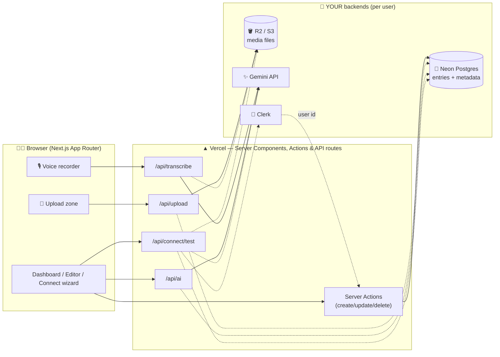
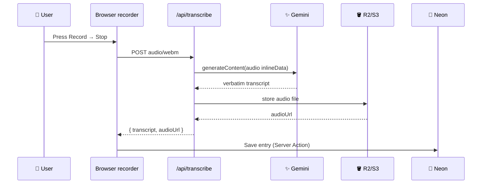

<div align="center">

# 🎙️ Your Voice Journal 📝

### AI-powered voice + multimedia journaling on **your own** Neon Postgres, S3/R2, Gemini & Clerk.

[](https://nextjs.org/)
[](https://www.typescriptlang.org/)
[](https://tailwindcss.com/)
[](https://www.prisma.io/)
[](https://neon.tech/)
[](https://aistudio.google.com/)
[](https://clerk.com/)
[](https://your-voice-journal.vercel.app/)
[](https://github.com/aniruddhaadak80/your-voice-journal/actions)
[](LICENSE)

**🌐 Live demo:** https://your-voice-journal.vercel.app · **🔌 Setup wizard:** [/connect](https://your-voice-journal.vercel.app/connect) — paste keys, test live, done.

No shared database. No shared API keys. Every user brings their own backends — the app is just the beautiful shell around *your* data.

</div>

---

## ✨ Features

| Area | What you get |
|------|--------------|
| 🎙️ **Voice journaling** | Browser recorder → Gemini transcription → transcript + audio URL saved in Postgres |
| 🖼️ **Multimedia** | Images, video, audio, PDFs, docs via S3-compatible upload (`/api/upload`) + gallery |
| ✍️ **Rich text** | TipTap editor — headings, lists, code, quotes, links, embedded uploads |
| 🔍 **Search** | Full-text-ish search over title + content + transcript (+ optional `tsvector` migration) |
| 🤖 **AI** | Summarize, suggest tags, **Ask-my-journal** (retrieval + grounded answers) |
| 🔌 **Connect wizard** | `/connect` — step-by-step guides with links, paste-to-test Neon/S3/Gemini/Clerk, `.env` generator |
| 🔐 **Clerk auth** | Per-user private journals when keys set; graceful single-user demo mode otherwise |
| 📤 **Export** | One-click JSON / Markdown download of your entries |
| 🎨 **Modern UI** | Tailwind v4, dark mode, Framer Motion transitions, skeletons, Suspense streaming |

## 🧰 Tech stack

| Layer | Choice | Why |
|-------|--------|-----|
| Framework | **Next.js 15** App Router | Server Components, Server Actions, streaming, `loading`/`error` boundaries |
| Language | **TypeScript 5** | End-to-end type safety |
| Styling | **Tailwind CSS v4** + `next/font` (Inter) | Design system, dark mode, zero font CDN |
| Animation | **Framer Motion** · Icons **lucide-react** | Page/list/modal micro-interactions |
| ORM | **Prisma 5** | Typed Postgres access, migrations, seed |
| Database | **Neon Postgres** (BYO) | Serverless Postgres, branching, free tier |
| Files | **S3-compatible** (Cloudflare R2 / AWS S3) | 50 MB uploads, images/video/audio/PDF/docs |
| AI | **Google Gemini** (BYOK) | Transcription + summaries + tags + Q&A, generous free tier |
| Auth | **Clerk** (optional) | Sign-in, per-user data isolation, drop-in UI |
| Editor | **TipTap 2** | ProseMirror-based, keyboard accessible |
| Tests/CI | **Vitest** + GitHub Actions + Vercel | Typecheck, lint, tests, build on every push |

## 🏗️ Architecture



## 🎙️ Voice flow



## 🚀 Quickstart (local)

```bash
pnpm install
cp .env.example .env   # fill in — or use the /connect wizard on the live site
pnpm exec prisma migrate deploy
pnpm run db:seed       # optional demo entries
pnpm dev               # → http://localhost:3000
```

> The app **never crashes** without env vars — it shows the Connect wizard state instead. `/api/status` reports db/storage/ai/auth health.

## 🔌 Connect your own backends (3 minutes)

Prefer the UI? Open **[/connect](https://your-voice-journal.vercel.app/connect)** — guides, live connection tests, and a `.env` generator.

1. **Neon Postgres → `DATABASE_URL`**
   [console.neon.tech](https://console.neon.tech) → New Project → Connection Details → copy string ([docs](https://neon.tech/docs/connect/connect-from-any-app))
2. **Storage → `S3_*`**
   [dash.cloudflare.com](https://dash.cloudflare.com) → R2 → bucket + API token ([R2 docs](https://developers.cloudflare.com/r2/)) — or [AWS S3](https://s3.console.aws.amazon.com)
3. **Gemini → `GEMINI_API_KEY`**
   [aistudio.google.com/apikey](https://aistudio.google.com/apikey) → Create key (free)
4. **Clerk (optional) → `NEXT_PUBLIC_CLERK_PUBLISHABLE_KEY` + `CLERK_SECRET_KEY`**
   [dashboard.clerk.com](https://dashboard.clerk.com) → app → API keys ([Next.js guide](https://clerk.com/docs/quickstarts/nextjs)) → **redeploy**
5. **Migrate**: `pnpm exec prisma migrate deploy` (+ optional `psql $DATABASE_URL -f prisma/fulltext.sql` for `tsvector` ranking)

## ▲ Deploy (Vercel)

```bash
vercel --prod   # or: https://vercel.com/new → import your-voice-journal
```

Then Project → Settings → Environment Variables → paste all vars → **Redeploy**. Run step 5 above once against prod, and check `/api/status` — everything should read green.

## 📜 Scripts

`dev` · `build` · `start` · `lint` · `format` · `test` (`vitest`) · `db:migrate` · `db:deploy` · `db:seed`

## 🗺️ Routes

`/` dashboard+search · `/entry/new` create · `/entry/[id]` view/edit · `/connect` wizard · `/settings` status+export · `/sign-in` · `/sign-up` · `/api/upload` · `/api/transcribe` · `/api/ai` · `/api/export` · `/api/status` · `/api/connect/test`

## 🔐 Auth model

All DB helpers take `userId`. With Clerk keys, `getUserId()` returns the Clerk id (each user sees only their rows); without keys it falls back to `DEFAULT_USER_ID` demo mode. Swap in any provider later by changing one function.

## 🤝 Contributing

PRs welcome! `pnpm exec tsc --noEmit && pnpm exec vitest run && pnpm run build` must pass. See CI: `.github/workflows/ci.yml`.

## 📄 License

MIT — your data stays yours.
